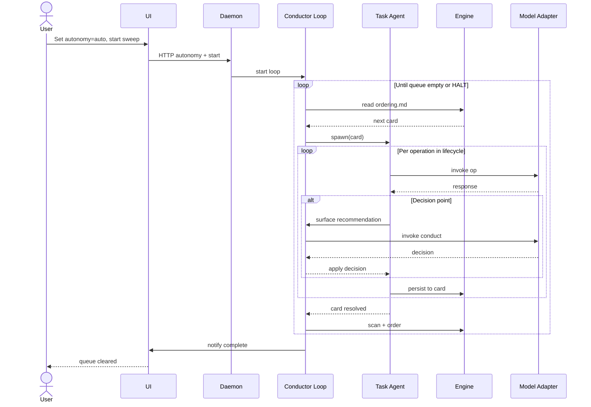
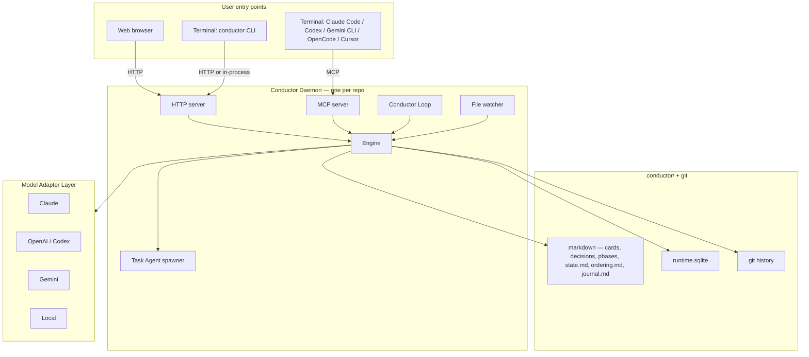
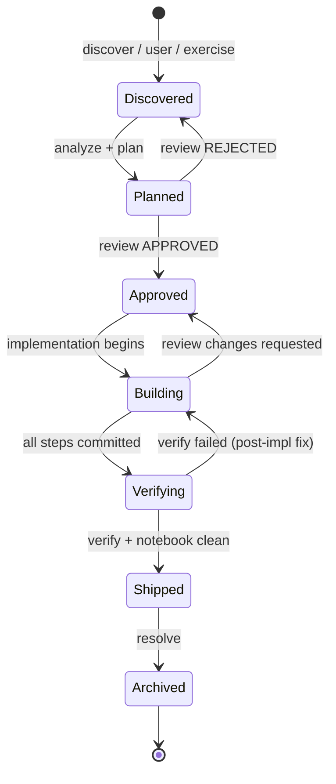
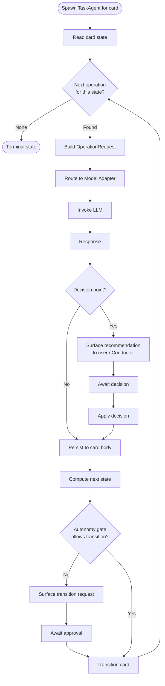
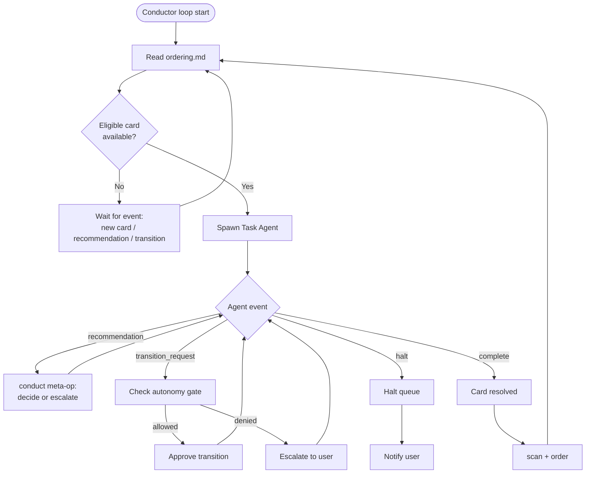
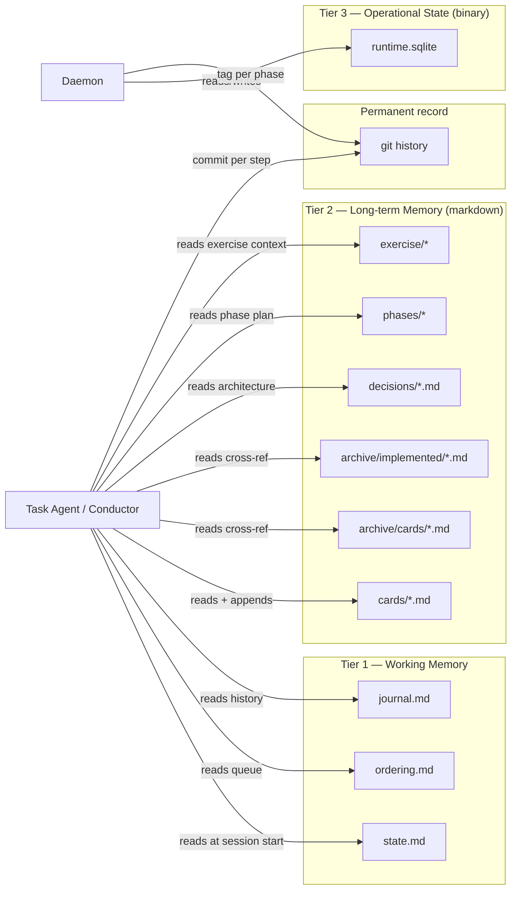
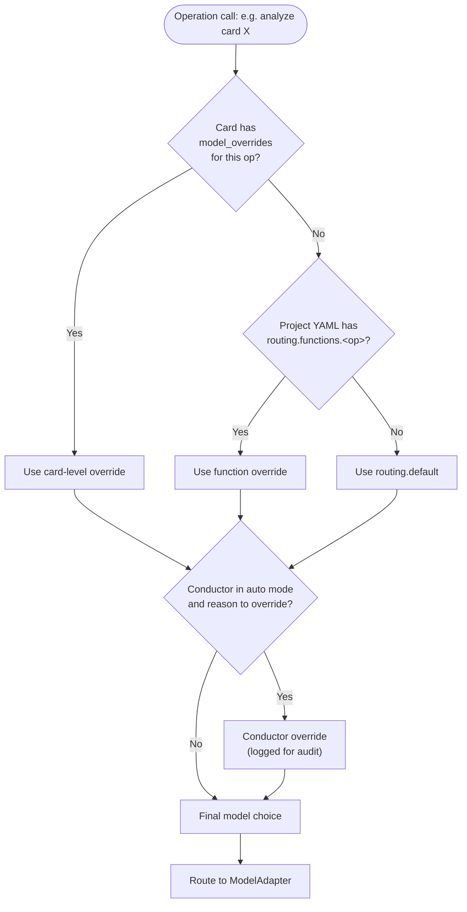

> **For implementers:** The Relay, Control, and Symphony folders inside this
> repo (`Harness\Relay`, `Harness\Control`, `Harness\symphony`) are the
> authoritative reference implementations Conductor draws from. When this
> spec describes Relay or Control behavior, the in-repo copies are the
> ground truth — read them directly rather than re-deriving the logic.

# Conductor — Design Specification

## Summary

Conductor is a per-repo, model-agnostic AI engineering harness that unifies three previously separate tools:

- **Relay** — a 20-skill workflow pipeline (discover → analyze → plan → review → implement → verify → resolve) with `.relay/` as persistent project memory.
- **Control** — a session-discipline framework with five mechanical invariants (`STATE.md` cursor, commit per step, tag per phase, atomic state update, drift detection).
- **Symphony** — a long-running autonomous orchestrator that polls an issue tracker, creates per-issue workspaces, and runs coding agents at bounded concurrency.

It exposes four surfaces (CLI, UI, MCP server, HTTP/JSON-RPC API), runs every operation through a pluggable Model Adapter Layer, and routes each operation to whichever LLM is best suited for it (Claude / OpenAI / Gemini / local).

A two-tier intelligence model — **Task Agent** per card and **Conductor** across the queue — lets the operator toggle autonomy on any project from full-manual to fully-autonomous, walking a queue of N issues without supervision when allowed.

## 1. Problem statement

Each of the three source tools fills one corner of a coherent triangle, but none of them alone is sufficient for autonomous-or-supervised AI engineering at scale.

| Tool | Owns | Does not own |
|---|---|---|
| Relay | Workflow pipeline; persistent in-repo memory; cross-CLI compatibility | Dispatch; multi-task concurrency; mechanical drift detection |
| Control | Session discipline; STATE.md cursor; commit/tag enforcement; drift detection | Workflow content; multi-task scheduling; per-task isolation |
| Symphony | Per-issue workspaces; autonomous polling; bounded concurrency; observability | Workflow pipeline; in-session discipline; per-operation model routing |

**Three failure modes the unified product must prevent:**

1. **AI amnesia.** Sessions start from zero. Relay solves this with `.relay/`. Conductor inherits.
2. **Silent drift.** STATE.md disagrees with git or with the codebase. Control solves this with mechanical hooks. Conductor inherits.
3. **Manual dispatch as bottleneck.** When a project has 100 issues, a human can't sit and walk each through `analyze → plan → review → implement → verify → resolve`. Symphony solves this with autonomous orchestration. Conductor inherits — and adds queue-aware decision-making the source spec leaves to a human.

**Two failure modes specific to combining them:**

4. **Workflow logic locked to one model's runtime.** Relay's skills run inside Claude Code; Control's hooks rely on Claude Code's hook system. The unified product MUST be model-agnostic — engine logic owns workflow + discipline; the model is a pluggable executor.
5. **Integration silos.** AI coding CLIs (Claude Code, Codex, Gemini CLI, OpenCode) have their own plugin ecosystems. The unified product MUST be reachable from inside those CLIs as a first-class tool, not a foreign CLI shellout.

## 2. Goals

- **Per-repo deployment.** One Conductor per repo. No multi-repo daemon, no machine-level service, no cross-project queue. Single-project state model is the foundation.
- **Four surfaces over one engine.** CLI, UI, MCP server, HTTP/JSON-RPC API. All thin clients of the same engine API.
- **Model-agnostic engine.** Workflow operations are typed functions; the model is dispatched to via a Model Adapter Layer. Per-operation routing (analyze on Opus, scan on Gemini, verify on Haiku, drift detection local).
- **Two-tier intelligence.** Task Agent (per-card) surfaces recommendations with reasoning at decision points. Conductor (queue-wide) consumes those recommendations and decides — escalating to user when autonomy disallows.
- **Kanban-as-autonomy-boundary.** The Relay lifecycle becomes a six-column kanban. Each column transition has a configurable autonomy policy (manual / assist / auto). Drag-to-transition in the UI is exactly the same act as the Conductor advancing a card autonomously.
- **First-class integration with foreign AI CLIs.** Plugins inside Claude Code, Codex, Gemini CLI, and OpenCode call Conductor via MCP without writing per-tool wrappers.
- **Migration from existing Relay/Control installs.** A one-shot `conductor import` flow reads `.relay/` and `.control/` and produces `.conductor/` cards and state.
- **Backward-compatible operation during transition.** Existing Claude Code skill/hook installs keep working; users can run both side-by-side until they trust Conductor.

## 3. Non-goals

- Multi-repo Conductor instances or cross-project queues. (One Conductor per repo, period.)
- A general-purpose workflow engine. Operations and lifecycle are opinionated to AI engineering work.
- Replacing Claude Code / Codex / Gemini CLI / OpenCode. Conductor integrates with them; users keep using their preferred CLI.
- A hosted / SaaS service. Conductor runs locally per repo. Cloud deployment is out of scope for v1.
- Built-in business logic for editing tickets, PRs, or comments in external trackers. (That is delegated to per-tracker adapters in Phase 7; v1 keeps it tracker-agnostic.)
- Mandating a single sandbox or approval posture. Like Symphony, trust/safety is implementation-defined per deployment.

## 4. System architecture

Layered. Each layer has one responsibility. Higher layers depend on lower layers, never the reverse.

```
┌──────────────────────────────────────────────────────────────────┐
│  SURFACES                                                        │
│                                                                  │
│  CLI                  UI               MCP server   HTTP/JSON-RPC│
│  conductor *          local web app    Claude Code  CI scripts, │
│  thin client of       (board/chat/     Codex        webhooks,   │
│  daemon when up;      monitor)         Gemini CLI   simple      │
│  embedded otherwise   talks via HTTP   OpenCode     integrations│
│                                        plugins                  │
└──────────────────────────────────────────────────────────────────┘
                             │  (all surfaces share one engine API)
                             ▼
┌──────────────────────────────────────────────────────────────────┐
│  CONDUCTOR LOOP   queue-aware decision intelligence              │
│  Consumes Task Agent recommendations; re-runs scan+order after   │
│  each card; honors autonomy thresholds; halts on conditions      │
└──────────────────────────────────────────────────────────────────┘
                             │
                             ▼
┌──────────────────────────────────────────────────────────────────┐
│  TASK AGENT LOOP  per-card execution                             │
│  Walks one card through Operations; surfaces decision points     │
│  with recommendations + reasoning when judgment is required      │
└──────────────────────────────────────────────────────────────────┘
                             │
                             ▼
┌──────────────────────────────────────────────────────────────────┐
│  ENGINE   typed operations + lifecycle state machine + hooks     │
│  Operation Library · Card CRUD · Hook Bus · Persistence          │
└──────────────────────────────────────────────────────────────────┘
                             │
                             ▼
┌──────────────────────────────────────────────────────────────────┐
│  MODEL ADAPTER LAYER   one Operation call → one model invocation │
│  Claude · OpenAI/Codex · Gemini · Local · …                      │
│  Routing: YAML default + function/card override + Conductor      │
└──────────────────────────────────────────────────────────────────┘
                             │
                             ▼
┌──────────────────────────────────────────────────────────────────┐
│  PROVIDERS  (vendor SDKs the adapters wrap)                      │
└──────────────────────────────────────────────────────────────────┘
```

### Memory & state architecture

Conductor unifies Relay's lifecycle-accretion memory with Control's cursor + git-narrative memory into a **three-tier model**. Each tier has one purpose, one storage substrate, and one reader.

#### Tier 1 — Working memory (cursor)

Small, mutable, human-readable markdown. The AI's "where am I right now" answer. **Reader:** every session, before any operation. **Writer:** atomic at session end (Control invariant 4).

- `.conductor/state.md` — current cursor (Control's STATE.md, kept verbatim). Phase, current card, next action, recent decisions. Single source of truth.
- `.conductor/ordering.md` — prioritized queue across all active cards (Relay's relay-ordering.md). Generated by `order` operation; consumed by Conductor when picking next card.
- `.conductor/journal.md` — append-only one-liner per session (Control's journal). Run history without context-window bloat.

#### Tier 2 — Long-term memory (accreting markdown)

The AI's reference library. Selectively loaded into context per task — never bulk-loaded. **Reader:** Task Agent for the active card + cross-references; `analyze` and `discover` operations for archive scanning.

| Path | Content | Lifecycle pattern |
|---|---|---|
| `.conductor/cards/<id>.md` | Active cards. Body sections accrete: Original → Analysis → Plan → Review → Implementation Guidelines → Verify Report → Resolution. | **Relay-style accretion.** One file = full audit trail of one item. |
| `.conductor/archive/cards/<id>.md` | Resolved cards with full lifecycle preserved. | Archived on `resolve`; never modified. |
| `.conductor/archive/implemented/<id>.md` | Concise resolution summary (Relay's `.relay/implemented/`). | Created by `resolve`; immutable. |
| `.conductor/decisions/<n>-<slug>.md` | Architecture Decision Records. | **Control-style ADRs.** Immutable once `accepted`. |
| `.conductor/phases/<phase>/README.md` + `steps.md` | Phase scaffolding (goal, done criteria, rollback, deferred items). | **Control-style phases.** Owned by `/phase-close` equivalent. |
| `.conductor/exercise/<session>/` | Active exercise sessions (Relay parity). | Per-session subfolder; archives to `archive/exercise/<session>/`. |
| `.conductor/archive/notebooks/<id>.ipynb` | Verification notebooks. | Created by `verify` notebook step. |

**This is the only memory layer the AI reads for project context.** No duplication with Tier 1 — `state.md` knows where we are; cards know what was decided about each item; ADRs/phases hold cross-cutting decisions that span items.

#### Tier 3 — Operational state (indexed, binary)

`.conductor/runtime.sqlite`. **Not memory.** Daemon bookkeeping only — never loaded into model context.

Schemas:

- `queue` — cards in flight, retry timers, due_at_ms, attempt counters
- `sessions` — live Task Agent metadata (thread_id, turn_id, current op, token totals). v1 has at most one row (single-agent; see §14)
- `cost` — per-card and per-day token + dollar totals (cost-ceiling enforcement)
- `index` — derived inverted index over cards by file path, label, kind, blocked_by (enables fast lookups like "which cards touched src/auth/" without scanning every markdown file)

(Replay / observability of Hook Bus events lives in `.conductor/runs/<run-id>/` JSONL files, not SQLite — see §14 for the schema commitment.)

Hidden behind an internal `runtime.ts` interface. **Implementation may swap from SQLite to event-sourced JSONL + materialized views in v2 without touching engine logic.** SQLite is the v1 choice because it's embedded, zero-dependency, atomic for concurrent daemon writes, and queryable for the index.

#### Permanent record (git)

Every step ships a commit (`<type>(<phase>.<step>): <subject>`); every phase closes with a tag. Lifted directly from Control. `git reset --hard <phase-tag>` is the rollback primitive. Commits + tags + cards + archive together form the audit trail; nothing critical to recovery lives only in `runtime.sqlite`.

#### Recovery

Snapshots in `.conductor/snapshots/`. PreCompact / Stop / SessionEnd hooks (see §6) each write checkpoint files for `state.md`, `journal.md`, and `ordering.md`. `conductor recover` restores from any snapshot.

SQLite runtime state is **volatile** — daemon restart drops live session metadata, in-flight retry-timer remainders, and rolling counters. Queue order is rebuilt from `ordering.md` on startup; the cost-ceiling counters reset to the current day's totals from the most recent run log. In-flight Task Agents at unclean shutdown leave their cards mid-lifecycle; the `dirty` flag in `.conductor/snapshots/sessionend-dirty-<ts>.flag` (Control parity) marks the unclean exit so the next session reconciles. SQLite is therefore not snapshotted.

## 5. Domain model

### 5.1 Card

The unified work item. Subsumes Relay's issues and features, Control's issues, Symphony's tickets, and exercise findings. One file per card at `.conductor/cards/<id>.md`.

```yaml
---
id: 2026-05-06-auth-token-expiry
title: Auth token expires silently
kind: issue | feature | exercise-finding | imported
column: discovered | planned | approved | building | verifying | shipped | archived
phase: phase-2-auth                              # project phase membership
priority: 1
autonomy: inherit | escort | assist | auto      # task-level override
model_overrides:                                 # optional, per-operation
  analyze: claude-opus-4-7
  implement: codex
created: 2026-05-06T12:34:56Z
source: discover | user | linear | exercise:<session>
labels: [auth, regression]
blocked_by: []
---
```

**Card ID format.** Canonical: `<YYYY-MM-DD>-<slug>`, where slug is the title lowercased, with `[^a-z0-9-]` replaced by `-`, and runs of `-` collapsed. Filename = `<id>.md`. Imported cards keep their tracker source as a prefix: `linear-ABC-123-<original-slug>`, `gh-456-<original-slug>`. The migration importer prepends file-creation date to Relay slugs that don't carry one.

```

# Original Issue
... problem, impact, proposed fix, affected files ...

---
## Analysis
... appended by analyze operation ...

---
## Implementation Plan
... appended by plan operation ...

---
## Adversarial Review
... appended by review operation ...

---
## Implementation Guidelines
... appended on review APPROVED ...

---
## Verification Report
... appended by verify operation ...

---
## Resolution
... appended by resolve operation ...
```

Body sections accrete over the lifecycle. The format is identical to Relay's lifecycle file structure, ensuring drop-in migration of existing Relay archives.

### 5.2 Operation

A typed engine function. Each has explicit input/output schemas; LLM-driven where judgment is required, deterministic where possible.

```typescript
// Card lifecycle operations
analyze(card: Card)                          → Analysis
plan(card: Card, analysis: Analysis)         → Plan
review(card: Card, plan: Plan)               → Verdict
implement(card: Card, plan: Plan, step: N)   → Diff           // one step per call
verify(card: Card)                           → VerifyReport
notebook(card: Card)                         → NotebookFile   // Jupyter; final Verifying step
resolve(card: Card)                          → ResolutionDoc

// Project-wide operations
discover(repo: RepoState)                    → Card[]
scan()                                       → Status
order(status: Status)                        → Ordering
detect_drift(state: StateMd, git: GitState)  → Drift[]

// Conductor + surface operations
conduct(queue, recommendation, ctx)          → Decision       // Conductor's meta-op
chat(card?: Card, project: ProjectCtx, msg)  → ChatReply      // chat surface op
                                                              // (may invoke file_card tool)

// Exercise op family — share session state in .conductor/exercise/<session>/
exercise_map(goal?: string)                  → Session        // capability map or goal journey
exercise_run(session: Session)               → Findings       // run scenarios, capture findings
exercise_file(session: Session, finding)     → CardOrNote     // file finding as card or keep as note
exercise_auto(session: Session)              → Summary        // sweep run + file across session
```

Operations consume + emit events on the Hook Bus. They never invoke models directly — they ask the Model Adapter Layer for a response to an `OperationRequest`. **This is what makes the engine model-agnostic.**

### 5.3 Lifecycle / Kanban

Six columns + archive, mapped 1:1 to the Relay pipeline:

```
Discovered → Planned → Approved → Building → Verifying → Shipped → (Archived)
   │           │          │          │          │           │
filed by    analyze+   review     implement  verify+      resolve
discover/   plan       passed     per step,  notebook
user/exer   complete              commit/step
```

Column transition = autonomy boundary. Policies per project in `.conductor/config.yaml`:

```yaml
autonomy:
  default: assist
  transitions:
    discovered_to_planned:    auto      # cheap, low-risk
    planned_to_approved:      assist    # ask unless review verdict APPROVED
    approved_to_building:     manual    # always require human
    building_to_verifying:    auto      # automatic on commit success
    verifying_to_shipped:     assist    # ask unless verify is clean
```

Per-card overrides in card frontmatter take precedence over project defaults; the Conductor in `auto` mode may further override under its own confidence policy.

#### Phases × kanban — orthogonal axes that compose

Phases (Control-style: `Foundation → Auth → API → UI → Ship`, each with done criteria, each tagged in git on close) and the kanban lifecycle (`Discovered → Shipped → Archived`, per-card pipeline) are orthogonal — both apply to every card simultaneously.

- **Phase** is a *project milestone*. It groups cards, has done criteria, closes with a git tag (`phase-2-auth-closed`), and is the recovery boundary (`git reset --hard <phase-tag>`). Every card has `phase: <phase-name>` in frontmatter.
- **Kanban column** is a *per-card pipeline state*. It says where in the work pipeline a single card is, regardless of which phase it belongs to.

The board can filter by phase (`show me Phase 2 cards in Building`). `phase-close` requires every card in the phase to be `Archived` (or the deferred-carry-forward path from Control kicks in: unfinished work moves to the next phase's Deferred section). Closing a phase does **not** alter the kanban state of its cards — it just gates "done" on aggregate column = Archived.

### 5.4 `.conductor/` directory layout

The layout is the materialized form of the three-tier memory model from §4.

```
.conductor/
│
│   ── Tier 1 — working memory (cursor) ──
├── config.yaml          routing + autonomy + project settings
├── state.md             current cursor (Control's STATE.md, kept verbatim)
├── ordering.md          generated; current phased queue across cards
├── journal.md           append-only one-liner per session
│
│   ── Tier 2 — long-term memory (accreting markdown) ──
├── cards/               active cards; lifecycle accretes per file
│   └── <id>.md
├── archive/
│   ├── cards/           resolved cards (full lifecycle preserved)
│   ├── implemented/     concise resolution summaries (Relay-style)
│   ├── notebooks/       verification notebooks
│   └── exercise/        archived exercise sessions
├── decisions/           ADRs (Control-style; immutable once accepted)
│   └── <n>-<slug>.md
├── phases/              phase scaffolding (Control-style)
│   └── <phase-name>/
│       ├── README.md
│       └── steps.md
├── exercise/            active exercise sessions (Relay-style)
│   └── <session>/
│       └── _control.md
│
│   ── Tier 3 — operational state (binary, indexed) ──
├── runtime.sqlite       daemon bookkeeping; NOT loaded into model context
│
│   ── recovery + audit ──
├── snapshots/           PreCompact / Stop / SessionEnd checkpoints
├── runs/                replay-able per-task-agent run logs (JSONL)
└── auth.token           daemon HTTP/MCP bearer; gitignored
```

`auth.token` and `runtime.sqlite` are gitignored on `conductor init`; everything else is committed (the cards, decisions, phases, journal ARE the project's memory and belong in version control).

## 6. Engine

### Language and runtime

**TypeScript on Node 20+**, single-language stack across engine, CLI, adapters, daemon, and UI.

Rationale:
- **First-class SDKs.** Anthropic, OpenAI, Google Gen AI, and the Model Context Protocol reference server library all ship TypeScript-native SDKs.
- **One language end-to-end.** Engine, CLI, daemon, and UI (Next.js / Vite + React) all share the TS toolchain; no FFI boundary, no second-language barrier between the daemon and the UI shell it serves.
- **Distribution parity with Relay/Control.** Both ship via `npx <tool>-workflow init`; Conductor mirrors that with `npx conductor-workflow init`, giving operators a familiar install path.
- **Cross-platform.** Node 20+ runs identically on Linux, macOS, and Windows — matches the cross-runtime story Control's bash/PowerShell hook ports were trying to achieve, but in one runtime instead of two (verified by Control's own `tests/i5-parity` work).

Trade-off acknowledged: single-threaded event loop means careful isolation of the Task Agent's LLM HTTP call. v1 doesn't try to run two agents concurrently anyway (§14); if concurrency becomes load-bearing in v2, worker threads or Rust rewrites of hot paths are evolution paths.

### Engine layout

```
engine/
├── ops/             analyze, plan, review, implement, verify, notebook,
│                    resolve, scan, order, discover, exercise_*,
│                    detect_drift, conduct, chat
├── state/
│   ├── card.ts      CRUD on .conductor/cards/*.md (frontmatter + body)
│   ├── runtime.ts   SQLite: queue, retry state, live sessions, totals
│   └── git.ts       commit-per-step, tags, drift detection
├── hooks/
│   ├── bus.ts       event bus; subscribers are pure functions
│   ├── pre_compact.ts
│   ├── session_start.ts
│   ├── session_end.ts
│   ├── stop.ts
│   └── transition.ts
└── lifecycle.ts     column transition rules + policy gates
```

### Hook Bus

**Same functionality as Control's hooks; different delivery mechanism.**

Control today wires four Claude Code hook events (`PreCompact`, `SessionStart`, `SessionEnd`, `Stop`) to bash and PowerShell scripts. That works because Control runs inside Claude Code's runtime, which gives you the hook system for free. Conductor has its own engine, so it provides the equivalent natively.

The Hook Bus is **in-process** and **internal-only for v1**. Engine emits events; subscribers are TypeScript modules registered at startup; no shell scripts. This trades Control's per-runtime parity work (bash + PS twin ports verified by `tests/i5-parity.{sh,ps1}`) for one implementation that runs everywhere.

| Event | Emitted by | Subscribers do |
|---|---|---|
| `SessionStart` | CLI start, daemon connect, MCP attach | Field-by-field drift check vs git; emit `[control:drift]` data |
| `SessionEnd` | CLI exit, daemon disconnect | Atomic state.md update; journal append; snapshot |
| `PreCompact` | Adapter signals context compaction imminent | Snapshot state.md / journal / ordering.md |
| `Stop` | Adapter signals turn complete | Per-turn snapshot (separate retention pool) |
| `CardTransition` | Lifecycle advance | Persist new column; emit autonomy gate event |
| `OperationComplete` | Op returns | Persist output to card; emit pipeline event |

The bus runs in-process inside the daemon. CLI invocations without a daemon emit events to a stub bus that runs only the persistence subscribers (no notifications, no UI updates).

**Hook events are not routed.** The Model Adapter Layer (§7) routes *operations* to LLM providers. Hook events run pure-function subscribers in-process and never invoke a model. If a subscriber needs LLM judgment (rare), it dispatches an Operation through the engine, which then routes per the normal precedence chain.

**Out of scope for v1: external user-defined hooks.** A later phase MAY add a `.conductor/hooks/` directory where users can drop scripts that subscribe to the bus, parity with Control's current model. Phase 7 candidate; not committed.

### Drift detection

Lifted from Control. Compares `state.md` to current `git status` / `git log` / `git describe`. Detects: branch mismatch, last-commit mismatch, uncommitted-state mismatch, tag mismatch, state-md-template / state-md-missing / state-md-unparseable. Outputs structured `[control:drift]` blocks consumed by the surface layer.

Implementation: native code, deterministic. Routed to the `local` adapter for `detect_drift` (no LLM call needed).

## 7. Model adapter layer

```typescript
interface ModelAdapter {
  invoke(req: OperationRequest): Promise<OperationResponse>
  capabilities(): {
    tools: boolean
    contextWindowTokens: number
    streaming: boolean
    costTier: 'free' | 'cheap' | 'standard' | 'premium'
    supportsExtendedThinking: boolean
    supportsPromptCaching: boolean
  }
  estimateCost(req: OperationRequest): { tokens: number; dollars: number }
}
```

### Adapters shipped in v1 phasing

- `ClaudeAdapter` — wraps Anthropic SDK. Supports tool use, prompt caching (mandatory for cost), extended thinking. Default for analyze, plan, review.
- `OpenAIAdapter` — wraps OpenAI SDK. GPT-5, Codex models, Responses API. Default for implement.
- `GeminiAdapter` — wraps Gemini SDK. Large context (≥1M). Default for scan, discover.
- `LocalAdapter` — pluggable: Ollama, llama.cpp, vLLM endpoint. Default for `detect_drift` and other deterministic ops.

### Routing precedence (lowest → highest)

```
1. Adapter built-in default
2. Project YAML  (.conductor/config.yaml `routing`)
3. Function override  (`routing.functions.analyze: …`)
4. Card override  (frontmatter `model_overrides`)
5. Conductor decision  (autonomous mode for this transition)
```

### Example `.conductor/config.yaml`

```yaml
routing:
  default: claude-sonnet-4-6
  functions:
    analyze:        claude-opus-4-7      # heavy reasoning
    plan:           claude-opus-4-7
    review:         claude-opus-4-7      # adversarial; want best
    implement:      codex                # rapid impl
    verify:         claude-haiku-4-5     # cheap validation
    scan:           gemini-2.5-pro       # big context
    discover:       gemini-2.5-pro
    order:          claude-haiku-4-5
    detect_drift:   local                # deterministic; regex+git

autonomy:
  default: assist
  transitions:
    discovered_to_planned: auto
    planned_to_approved:   assist
    approved_to_building:  manual
    building_to_verifying: auto
    verifying_to_shipped:  assist

cost_ceilings:
  per_card_dollars: 5.00
  per_day_dollars:  50.00
  halt_on_breach:   true

mcp:
  socket: .conductor/mcp.sock
  tools_namespace: conductor

http:
  bind: 127.0.0.1
  port: 7180
```

The Conductor reads cost + capability metadata and may override the YAML when context demands (e.g., a 2M-token repo scan forces Gemini regardless of YAML's default). Such overrides are recorded in the run log for audit.

## 8. Task Agent

Spawned by user (CLI/UI) or Conductor (daemon). Walks one card through its remaining lifecycle.

```
TaskAgent(card_id):
  state = card.column
  while state != terminal:
    op = next_operation_for(state)
    req = build_request(card, op, project_context)
    resp = ModelAdapter.invoke(req)              # routed per config

    if resp.has_decision_point:
      surface_recommendation(card, op, resp)     # halts; emits to user/Conductor
      decision = await_decision()                # blocks until reply
      resp.apply(decision)

    persist_to_card(resp)
    next_state = lifecycle.advance(state, resp)

    if not autonomy.may_transition(state, next_state):
      surface_transition_request(card, state, next_state)
      await_approval()

    state = next_state
```

### Recommendation protocol (load-bearing)

When the Task Agent reaches a decision point, it emits:

```yaml
type: recommendation
card: <id>
operation: review
blast_radius: low | medium | high             # derived by Task Agent from
                                               # affected files, op type, plan
options:
  - id: approve
    confidence: 0.85
    rationale: |
      Plan is atomic; blast radius confined to src/auth/.
      Regression test covers prior failure mode at
      tests/test_clarify_path.py:42.
  - id: approve_with_changes
    confidence: 0.10
    rationale: Step 2.4 could split into 2.4a/2.4b for cleaner rollback.
  - id: reject
    confidence: 0.05
    rationale: Plan does not address blocker dependency on issue #34.
recommended: approve
```

`blast_radius` is computed by the Task Agent from operation type and affected
files (e.g., touching shared interfaces or migration files = `high`; isolated
new feature in a module = `low`). The Conductor's confidence policy uses both
`confidence` and `blast_radius` to decide whether to auto-approve.

The recipient (user OR Conductor) picks an option and responds. The Task Agent persists the decision in the card body (preserving full reasoning trail) and continues.

This is the unified primitive for ALL human/Conductor decision moments: review verdicts, plan ambiguity, verify edge cases, transition gates. One protocol, one persistence path, one audit trail.

## 9. Conductor

Long-running per-repo loop in the daemon. Inputs: `ordering.md`, all card frontmatter, `state.md`, recommendations from active Task Agents, autonomy config.

### Loop

```
Conductor():
  while running:
    queue = read_ordering()
    next_card = pick_eligible(queue)            # honors blockers, deps
    if next_card is None:
      wait_for_event()                          # new card, recommendation, transition
      continue

    agent = spawn_task_agent(next_card)
    while agent.alive:
      event = agent.next_event()
      match event:
        recommendation: handle_recommendation(event)
        transition_request: handle_transition(event)
        complete: break
        halt: handle_halt(event)

    rerun_scan_and_order()                      # queue may have shifted
```

### Autonomy modes

Project default in config; per-card override in frontmatter; Conductor self-override under `auto` (recorded for audit).

```
escort   — every recommendation surfaces to user; Conductor decides nothing
assist   — Conductor approves only high-confidence + low-blast-radius decisions
auto     — Conductor approves anything its confidence model clears
critical — auto, but if confidence drops below threshold, halt the queue
```

Confidence model details are implementation-defined per Conductor version; v1 uses a simple threshold scheme (`approve if recommended.confidence >= threshold AND blast_radius != 'high'`) and surfaces the threshold in config. Future versions may use a learned model trained on past escalations.

### HALT conditions

Lifted from Control, generalized for autonomous operation:

- New ADR needed (architectural choice not predetermined by the plan)
- Blocker without clear hypothesis
- Iteration budget hit (`CONTROL_MAX_AUTO_ITERATIONS` equivalent)
- Destructive action required (data loss, force push, dependency removal)
- Confidence below threshold for current autonomy mode
- Cost ceiling hit (per-card or per-day from config)
- Auth/secret needed (provider credential, deployment key)
- Unrecognized error from adapter (don't retry blindly; escalate)

### Meta: the conductor operation

The Conductor's own decision-making is itself an operation: `conduct(queue, recommendation, project_context) → Decision`. This means the meta-intelligence is also model-pluggable. Default routing for `conduct` is the strongest reasoning model in the routing config (`claude-opus-4-7` in the example).

## 10. Surfaces

### 10.0 Surface parity (all four are first-class)

All four surfaces (CLI, UI, MCP, HTTP) are thin clients of the same engine API. **None is privileged over the others.** The phasing in §12 lands CLI in Phase 1 and UI in Phase 5 only because UI requires the daemon + HTTP server (Phase 4); the order reflects build dependencies, not importance. After Phase 5, anything doable in the CLI is doable in the UI, and vice versa.

```
┌────────────────────────────────────────────────────────────────────┐
│  USER                                                              │
│                                                                    │
│   ┌─────────────┐  ┌────────────┐  ┌──────────────────────────┐    │
│   │ Web browser │  │ Terminal:  │  │ Terminal:                │    │
│   │             │  │ conductor  │  │ Claude Code / Codex /    │    │
│   │             │  │ CLI        │  │ Gemini CLI / OpenCode /  │    │
│   │             │  │            │  │ Cursor / Continue / etc. │    │
│   └──────┬──────┘  └─────┬──────┘  └─────────────┬────────────┘    │
│          │               │                       │                 │
│          │ HTTP          │ in-process or         │ MCP             │
│          │ (localhost)   │ HTTP fallback         │ (local socket)  │
│          ▼               ▼                       ▼                 │
└────────────────────────────────────────────────────────────────────┘
            │              │                       │
            └──────────────┼───────────────────────┘
                           ▼
┌────────────────────────────────────────────────────────────────────┐
│  CONDUCTOR DAEMON  (one process per repo)                          │
│                                                                    │
│  ├─ HTTP server   (UI + JSON-RPC clients)                          │
│  ├─ MCP server    (foreign AI CLIs and their plugins)              │
│  ├─ Conductor loop (queue intelligence, autonomy)                  │
│  ├─ Task Agent spawning + lifecycle                                │
│  ├─ File watcher (.conductor/ mutations → live UI updates)         │
│  └─ Engine (operations, hooks, model adapters)                     │
└────────────────────────────────────────────────────────────────────┘
                           │
                           ▼
                    .conductor/  +  git
```

The user has many entry points; they all converge on the daemon. The daemon owns one truth: `.conductor/` + git. It does not matter which surface filed a card or which AI tool ran the analyze op — the result lands in the same place and is visible everywhere else immediately.

When the daemon is not running, the CLI runs the engine embedded in-process. When the daemon IS running, the CLI is a thin HTTP client of the daemon (so concurrent CLI + UI + foreign-CLI access all serialize through one engine instance — no split-brain on `.conductor/` writes).

**What "first-class UI" concretely means** (since UI is built later in the phasing):

- Full feature parity with the CLI; no shellout to `conductor` from the UI for any task
- Native UX, not CLI-in-browser: drag-drop transitions, side-by-side card detail + live agent stream, rendered markdown, live token counters, Symphony-style multi-agent monitor
- Real-time updates from the file watcher: external editor edits to `.conductor/cards/` reflect immediately in the board
- Conductor-native chat: chat IS a Task Agent invocation through the project's `chat` operation, routed via the same Model Adapter Layer — so chat uses YOUR routing config (your chosen model, your overrides), not whatever model the host CLI happens to wrap

### 10.1 CLI

Native first-class CLI. Mirrors and supersedes Relay/Control commands.

```
conductor init                                  # set up .conductor/
conductor card new <slug>                       # quick-file an issue/feature
conductor card list [--column <c>]
conductor work <card-id>                        # spawn Task Agent
conductor work next                             # pick from ordering, walk one
conductor scan | order | discover | exercise
conductor verify <card> | conductor resolve <card>
conductor session start | end
conductor daemon start | stop | status
conductor route <op> <model>                    # update routing
conductor autonomy set <mode>                   # project autonomy
conductor import .relay/ .control/              # one-shot migration
conductor recover                               # restore from snapshot
```

### 10.2 UI

Local web app served by the daemon's HTTP server. Talks HTTP only. Surfaces:

- **Board** — kanban; cards as tiles. Drag = transition. Columns show autonomy policy badges.
- **Card detail** — left: rendered card markdown. Right: live Task Agent stream when working. Bottom: decision-point UI when a recommendation is open.
- **Chat** — per-card or project-wide; chat IS a Task Agent invocation routed through the project's `chat` operation. User messages flow through the same Model Adapter Layer as every other operation.
- **Live monitor** — Symphony-style; all running Task Agents, token totals, current operation per agent.
- **Routing panel** — visualize + edit `.conductor/config.yaml` routing rules.

### 10.3 MCP server

#### What MCP is, briefly

**Model Context Protocol** is Anthropic's open protocol for AI tools to talk to external servers. Think of it as a universal adapter between AI CLIs and capabilities. Before MCP, integrating a project tracker with Claude Code meant baking in tracker support, writing a Claude-Code-specific plugin, or shelling out and parsing text. With MCP, you write **one server** that exposes capabilities, and any MCP-compatible AI CLI (Claude Code, Codex, Gemini CLI, OpenCode, Cursor, Continue, Cline, etc.) can use it as if it were native.

#### What it means for Conductor

The Conductor daemon runs an MCP server on a local transport:
- **POSIX:** Unix domain socket at `.conductor/mcp.sock` (gitignored)
- **Windows:** named pipe at `\\.\pipe\conductor-<repo-hash>`, where `<repo-hash>` is a stable hash of the absolute repo path (so multiple Conductor instances on one machine never collide)

Daemon writes the active transport path to `.conductor/mcp.endpoint` (gitignored) at startup; clients read that file to find the daemon. Any AI CLI you use — and any plugin running inside that CLI — connects to it and gets project-aware tools as native capabilities. Same project memory, same kanban, same autonomy policies, regardless of which AI tool is driving.

Tools exposed (initial set; namespace `conductor.*`):

```
conductor.card_new       create a new card
conductor.card_get       fetch a card by id
conductor.card_list      list cards (optionally filtered)
conductor.card_update    update frontmatter / append body
conductor.transition     move a card to a new column
conductor.scan           run scan operation
conductor.order          run order operation
conductor.discover       run discover operation
conductor.exercise_new   open an exercise session
conductor.exercise_file  file a finding into an exercise session
conductor.work_card      spawn Task Agent against a specific card
conductor.work_next      ask Conductor for next card per ordering
conductor.recommend      surface a recommendation manually (for plugins)
```

#### Three scenarios that illustrate the integration

**Scenario A — Plugin discovers something, files a card.**
You're in Claude Code with a `playwright` plugin doing visual regression testing. It finds a layout regression in the navbar. Without MCP it would print to your terminal and you would copy/paste somewhere. With MCP it calls `conductor.card_new(kind: "exercise-finding", title: "Navbar overflow on mobile", body: <screenshots + repro>)`. A card appears in the Conductor kanban board immediately. If autonomy mode allows, the Conductor schedules `analyze` against it. You watch this in the UI without touching the CLI.

**Scenario B — Switching CLIs mid-project, no context loss.**
Morning: Claude Code, working on architecture-heavy issues. Afternoon: Codex CLI, doing rapid implementation. Evening: Gemini CLI, scanning a 1M-token codebase for cross-cutting issues. **Same Conductor daemon, same `.conductor/`, same kanban, same memory.** Each CLI calls Conductor's MCP tools as needed. Card files accrete state from whichever AI worked on them. Drift detection fires when any of them desyncs from git. None of them know about the others; they all know about Conductor.

**Scenario C — Plugin ecosystem becomes Conductor-aware for free.**
A new plugin ships next month — say, `frontend-design` for Claude Code, or some Playwright-based testing plugin for Codex. As long as it's MCP-aware, it can call `conductor.card_new`, `conductor.exercise_file`, `conductor.transition` without ever knowing what Conductor is. The plugin author wrote against MCP; you get Conductor integration for free. Same for any future Codex/Gemini/OpenCode plugin.

#### Why this is more efficient than CLI shellouts

| | CLI shellout | MCP |
|---|---|---|
| Per-call overhead | spawn `conductor` process | one socket connection per CLI session |
| I/O | stdout text parsing, fragile | structured JSON with schemas |
| Streaming | hard | native |
| Discoverability | host CLI doesn't know what tools exist | host CLI lists tools + schemas at connect time |
| Cross-platform | shell quoting differs Win/Mac/Linux | uniform |
| Authoring | per-tool wrapper plugin per AI CLI | one MCP server serves all AI CLIs |

#### The CLI is still first-class for humans

MCP is the spine for AI CLIs. The Conductor CLI is the spine for humans typing in a terminal. Both call the same engine. They are not competing surfaces — they serve different callers.

### 10.4 HTTP/JSON-RPC API

For non-MCP clients: CI scripts, webhooks, the UI itself, simple shell integrations. Same operations as MCP, exposed over `127.0.0.1:7180` (configurable). Bearer-token authentication; token written to `.conductor/auth.token` on daemon start (gitignored).

### 10.5 Daemon

Single process per repo. Owns:

- Conductor loop
- Local HTTP server (UI + JSON-RPC)
- MCP server (Unix socket / named pipe)
- Task Agent spawning + lifecycle
- File watcher (mutations to `.conductor/` from CLI or external editor reflected live in UI)
- Optional Linear/GitHub poller (Symphony parity; deferred to Phase 7)

Lifecycle: `conductor daemon start` foreground or `--detach`. State in `.conductor/runtime.sqlite`. Graceful shutdown drains in-flight Task Agents; force-kill writes a `dirty` flag to be reconciled on next start.

## 11. Compatibility / migration

Don't deprecate Relay/Control; ship a one-shot importer:

```
conductor import .relay/ .control/
```

Reads existing relay issues/features/exercise sessions and Control STATE.md/phases/ADRs/issues, writes them as `.conductor/cards/`, `.conductor/state.md`, `.conductor/decisions/`, and `.conductor/phases/`. Existing Claude Code skill/hook installs keep working in parallel during transition.

**Reference implementations to read during build:** `Harness\Relay` and `Harness\Control` are the in-repo authoritative sources for the Relay and Control behaviors Conductor reproduces. Importer logic should be cross-checked against the lifecycle file shapes those projects ship.

Mapping rules:

| Source | Target |
|---|---|
| `.relay/issues/*.md` | `.conductor/cards/*.md` (kind: issue, column derived from existing sections — Original = discovered, +Analysis = planned, +Plan = approved, +Verify Report = verifying, etc.) |
| `.relay/features/*.md` | `.conductor/cards/*.md` (kind: feature) |
| `.relay/archive/issues/*.md` | `.conductor/archive/cards/*.md` (column: archived) |
| `.relay/implemented/*.md` | `.conductor/archive/implemented/*.md` (verbatim) |
| `.relay/exercise/<session>/` | `.conductor/exercise/<session>/` (verbatim) |
| `.relay/relay-status.md` | regenerated as part of `state.md` (Tier 1 working memory) |
| `.relay/relay-ordering.md` | `.conductor/ordering.md` (verbatim, then re-run `order` op to refresh) |
| `.control/progress/STATE.md` | `.conductor/state.md` (verbatim) |
| `.control/progress/journal.md` | `.conductor/journal.md` (verbatim) |
| `.control/architecture/decisions/*.md` | `.conductor/decisions/*.md` (verbatim; ADRs are immutable) |
| `.control/issues/OPEN/*.md` | `.conductor/cards/*.md` (kind: issue, column: building) |
| `.control/issues/RESOLVED/*.md` | `.conductor/archive/cards/*.md` (kind: issue, column: archived) |
| `.control/phases/*` | `.conductor/phases/*` (verbatim; phase plan still applies) |
| `.control/snapshots/*` | `.conductor/snapshots/*` (verbatim) |

Importer reports a per-file decision summary and asks for confirmation before writing.

**Filename normalization.** Imported card filenames adopt Conductor's canonical format (`<YYYY-MM-DD>-<slug>`; see §5.1). Relay's snake-case slugs (`user_auth_token_expired_silently.md`) are converted: separators normalized to `-`, file-creation date prepended when no date is in the name, original frontmatter preserved.

**ADR numbering continuation.** The importer preserves Control's existing ADR numbers (`0001`, `0002`, …) and continues from `N+1` for any new ADRs Conductor creates after migration. No renumbering.

**Case normalization.** Control's `STATE.md` (uppercase) becomes Conductor's `state.md` (lowercase) on import. Linux is case-sensitive; importer performs a real `git mv` so history follows the rename.

**`mcp.sock`, `mcp.endpoint`, `auth.token`, `runtime.sqlite`.** Added to `.gitignore` on import (alongside `.conductor/snapshots/`).

## 12. v1 phasing

Each phase ends with a dogfood-able product. We commit to single-repo vertical slice (option A from brainstorming), with multi-repo as out-of-scope.

```
Phase 1  Engine spine + CLI
         .conductor/ layout · Card CRUD · lifecycle state machine · Hook Bus
         Two ops: analyze, plan · One adapter: Claude
         CLI: init, card new, work
         OUTCOME: drive a card Discovered → Approved via CLI on Claude

Phase 2  Operations breadth + Control discipline + migration
         review, implement, verify, resolve, scan, order, discover, exercise
         Drift detection + commit-per-step + tag-per-phase
         conductor import .relay/ .control/
         OUTCOME: full Relay+Control pipeline runnable on Claude via CLI;
         existing repos can migrate without losing history

Phase 3  Multi-model
         OpenAI, Gemini, Local adapters
         Routing config + per-function/per-card overrides
         OUTCOME: operations route to different models per config

Phase 4  Daemon as request executor + MCP + HTTP
         Daemon process · IPC · file watcher
         Lifecycle state machine + DETERMINISTIC autonomy gates
           (manual blocks, auto fires, assist halts and surfaces — no
           confidence model yet)
         Task Agent runner (single-agent; max_concurrent_agents=1)
         MCP server with conductor.* tools
         HTTP/JSON-RPC server for non-MCP clients
         Recommendation protocol surfaces decision points to user (no
           Conductor brain to consume them yet)
         OUTCOME: external AI CLIs (Claude Code, Codex, Gemini CLI,
         OpenCode) can drive Conductor as a tool; humans drive
         autonomy gates manually from CLI or MCP responses

Phase 5  UI (manual mode fully usable)
         Local web UI: board, card detail, chat, live monitor, routing
           panel
         Drag-to-transition respecting deterministic autonomy gates
           (manual = popup confirm; auto = fire; assist = dialog with
           the agent's recommendation, user picks an option)
         Real-time updates from file watcher
         OUTCOME: kanban-driven workflow end-to-end with human in the
         loop on every assist/manual transition; no autonomy yet

Phase 6  Conductor brain (autonomous queue)
         conduct meta-op (model-routed)
         Confidence model resolving assist gates without human input
         Queue-watching loop (pick from ordering, spawn agents,
           consume recommendations, re-run scan + order)
         Autonomy modes: escort | assist | auto | critical
         HALT conditions + cost-ceiling enforcement
         OUTCOME: autonomous mode works end-to-end on a 100-issue
         queue; user toggles autonomy and walks away

Phase 7  Hardening
         Linear/GitHub adapters (Symphony parity for external trackers)
         Cost ceilings + telemetry + run log retention policies
         Adversarial autonomy testing (red-team Conductor decisions)
         Documentation, examples, dogfood scripts
         OUTCOME: production-ready for trusted-environment dogfood
```

## 13. Testing strategy

- **Operations** unit-tested with synthetic cards + mock adapter (deterministic, fast). Each operation has positive and negative cases plus edge cases (empty card, malformed plan, etc.).
- **Adapters** integration-tested per provider with cassettes (recorded API responses). Cassettes regenerated on adapter version bumps.
- **Lifecycle state machine** property-tested: no impossible transitions, every state reachable from `discovered`, every state has a defined exit, autonomy gates always evaluable.
- **Drift detection** parity-tested against Control's existing bash and PowerShell hook outputs (byte-equivalent for the same inputs, mirroring Control's `tests/i5-parity.{sh,ps1}` approach).
- **Conductor loop** simulated against pre-recorded Task Agent recommendation streams. Test: given a queue of N synthetic cards and a fixed recommendation script, does the Conductor produce the expected ordered transitions?
- **MCP server** tested via a stub Claude Code session that exercises every `conductor.*` tool.
- **End-to-end** dogfooded: Conductor manages building Conductor. Phase 2 onward, all Conductor development happens through Conductor.

## 14. Open questions / risks

- **Confidence model for the Conductor.** v1 ships a simple threshold scheme (`approve if recommended.confidence >= threshold AND blast_radius != 'high'`). Production-grade autonomy almost certainly needs a learned signal (calibrated probability that an approval will not regret) — but training data only exists once Phase 6 ships. Plan for v2.
- **Multi-Task-Agent concurrency (v2 evolution).** v1 commits to **single Task Agent per repo** (`max_concurrent_agents: 1` default). Avoids git tree races, matches Control's one-session-at-a-time mental model. v2 evolution: per-agent git worktrees (Symphony's pattern) — each Task Agent works in its own worktree, merges to main on `resolve`. Daemon serializes worktree creation/destruction; conflicts surface as recommendations.
- **Cost handling at scale.** A 100-card autonomous queue with Opus on analyze and review can cost real money. Cost ceilings are in v1 config; real economics need dogfood data.
- **Multi-operator on one repo.** Out of scope for v1 (single Conductor per repo, single human assumed). Future work: locks on `state.md`, conflict resolution on concurrent transitions.
- **Foreign-CLI MCP support drift.** Claude Code, Codex, Gemini CLI, and OpenCode all support MCP today, but versions and feature sets vary. Conductor's MCP server should target the lowest common denominator of the spec and feature-detect for advanced capabilities.
- **Provider API churn.** Anthropic / OpenAI / Google ship new model IDs and API features regularly. Adapters must be versioned independently from the engine, and the routing config should accept both pinned model IDs and capability tags (`reasoning-strong`, `large-context`, `cheap-validation`).
- **Symphony's Codex app-server protocol.** Symphony's spec ties to a specific Codex execution mode. Conductor's adapter layer abstracts over this, but Phase 4's MCP work and Phase 7's tracker adapters need to stay aware of how Symphony surfaces Codex events.
- **Run log schema (`.conductor/runs/<run-id>/`).** v1 commits to **JSONL**, one event per line, schemaed as `{ts, kind, op?, card_id?, payload}` where `kind ∈ {hook_event, op_request, op_response, recommendation, decision, transition, error}`. Retention policy: keep last 30 days or last 200 runs (whichever is larger), configurable. Tooling: `conductor run replay <run-id>` reads the JSONL and reconstructs the timeline.
- **Auth token lifecycle.** v1 generates `.conductor/auth.token` (UUIDv4, gitignored) on each daemon start. Old token invalidated on rotation. Token sent as `Authorization: Bearer <token>` for HTTP/JSON-RPC; MCP transport uses local-socket trust (file permissions). No expiry within a daemon lifetime; rotated on every start.
- **`work_card` idempotency.** If a Task Agent for that card is already running, `conductor.work_card(<id>)` returns `{status: "already-running", session_id: <id>}` instead of spawning a duplicate. Same applies to the CLI `conductor work <card>` command. The caller can attach to the live session instead of starting a new one.
- **`/relay-superplan` as a planning op family (deferred).** Relay's superplan dispatches 5 competing planning agents (Minimal Change · Performance-First · Safety-First · Refactor-Forward · Test-Driven) and synthesizes the best plan. v1 ships a single `plan` op. Future: a `plan_super(card, analysis) → Plan` op that the Conductor (or a user) chooses for high-blast-radius cards. Implementation is naturally Symphony-shaped — 5 isolated workspaces, parallel execution — and may benefit from Phase 4's daemon + Phase 6's Conductor brain working in concert. Open question: do we ship this as v2 or as a Phase 7 hardening item?
- **Phase × kanban edge cases.** What happens when a card is filed but no phase exists yet (early in a project)? Default: cards land with `phase: unassigned` and surface in the board's "Unassigned" lane. `/phase-close` skips them. New phases can claim unassigned cards on creation.

## 15. Visual diagrams

Reference companion to the prose. Each diagram illustrates one aspect of how Conductor is used or built. Intended for IDE / GitHub / GitLab Mermaid renderers; reads as plain text everywhere else.

### 15.1 User journey — manual mode (file → ship)

A user files a bug and walks it through every column manually. Shows how surface, daemon, engine, model adapter, and git interact end-to-end.

```mermaid
sequenceDiagram
  actor User
  participant UI as Conductor UI
  participant Daemon as Conductor Daemon
  participant Engine
  participant Adapter as Model Adapter
  participant Provider as LLM Provider
  participant Git

  User->>UI: File new card "Auth bug"
  UI->>Daemon: HTTP card_new
  Daemon->>Engine: card_new(kind=issue)
  Engine->>Engine: Write cards/&lt;id&gt;.md
  Engine-->>Daemon: card created
  Daemon-->>UI: card id
  UI-->>User: Card appears in Discovered

  User->>UI: Drag to Planned
  UI->>Daemon: HTTP transition + work
  Daemon->>Engine: spawn TaskAgent
  Engine->>Adapter: invoke analyze
  Adapter->>Provider: API call (routed)
  Provider-->>Adapter: analysis
  Adapter-->>Engine: Analysis
  Engine->>Engine: Append to card
  Engine->>Adapter: invoke plan
  Adapter->>Provider: API call
  Provider-->>Adapter: plan
  Adapter-->>Engine: Plan
  Engine->>Git: commit per step
  Engine-->>Daemon: card updated
  Daemon-->>UI: stream updates
  UI-->>User: card body grows

  Note over User,Git: Continues through Approved, Building, Verifying, Shipped
```

### 15.2 User journey — autonomous mode (queue sweep)

User toggles autonomy to `auto` and starts a queue sweep. Conductor walks N cards without supervision, escalating only when its confidence policy demands.



### 15.3 System architecture (component view)

How the surfaces, daemon internals, storage, and adapter layer wire together. Renderable counterpart to the ASCII diagram in §10.0.



### 15.4 MCP wiring — a plugin files a card from inside a foreign AI CLI

How a Claude Code (or Codex / Gemini / OpenCode) plugin discovers a finding and turns it into a Conductor card without writing any Conductor-specific integration.

```mermaid
sequenceDiagram
  actor User
  participant CC as Claude Code
  participant Plugin
  participant MCP as Conductor MCP server
  participant Engine
  participant FS as .conductor/
  participant UI as Conductor UI

  Note over CC,MCP: At Claude Code session start
  CC->>MCP: connect (local socket)
  MCP-->>CC: tool list (conductor.card_new, ...)

  Note over User,UI: Mid-session, plugin finds something
  User->>CC: run playwright tests
  CC->>Plugin: execute
  Plugin-->>Plugin: detects layout regression
  Plugin->>MCP: conductor.card_new(...)
  MCP->>Engine: card_new(kind, title, body)
  Engine->>FS: write cards/&lt;id&gt;.md
  FS-->>UI: file watcher event
  UI-->>User: card appears live in Discovered
  Engine-->>MCP: card_id
  MCP-->>Plugin: success
  Plugin-->>CC: Filed Conductor card
  CC-->>User: confirmation
```

### 15.5 Card lifecycle state machine

Every card moves through these states. Transitions are gated by the autonomy policy in §5.3.



### 15.6 Task Agent execution loop

The per-card execution flow. Same flow whether a human or the Conductor spawned the agent. Decision points and transition gates are the only halt mechanisms; everything else flows.



### 15.7 Conductor loop (autonomous mode)

The queue-management loop the daemon runs when autonomy is `assist` / `auto` / `critical`. The re-run of `scan + order` after each card completion is what makes the queue evolve as work shifts (a new finding from card N may reshape the priority of card N+1).



### 15.8 Memory architecture (three tiers)

Who reads what. Tier 2 is the only tier loaded into model context, and only selectively — never bulk. Tier 3 (SQLite) is daemon-only.



### 15.9 Model routing decision

For each operation call, the model is chosen via this precedence chain. The Conductor in `auto` mode may override the YAML-derived choice; the override is logged for audit.



## 16. References

### Authoritative source projects (read these directly during build)

- **Relay** — `G:\Projects\Small-Projects\Harness\Relay`
  - README: `Harness\Relay\README.md`
  - Skills: `Harness\Relay\tools\` (canonical workflow definitions for analyze/plan/review/verify/resolve/etc.)
  - Use as the ground truth for: card lifecycle accretion, exercise sessions, ordering pipeline, scope-formation lifecycle states (grouped run / promoted feature / superseded issue).

- **Control** — `G:\Projects\Small-Projects\Harness\Control`
  - README: `Harness\Control\README.md`
  - Templates: `Harness\Control\tools\`
  - Use as the ground truth for: STATE.md shape, drift detection logic, commit-msg shape (`<type>(<phase>.<step>): <subject>`), phase-close protocol, ADR shape, severity-gated issue model, snapshot/recovery protocol.

- **Symphony** — `G:\Projects\Small-Projects\Harness\symphony`
  - SPEC: `Harness\symphony\SPEC.md`
  - README: `Harness\symphony\README.md`
  - Use as the ground truth for: per-issue workspace lifecycle, autonomous orchestration loop, observability surfaces, agent-runner contract.

### Upstream sources (live projects evolving outside this repo)

- Original Relay: `G:\Projects\Small-Projects\Relay`
- Original Control: `G:\Projects\Small-Projects\Control`

### Other

- Brainstorming transcript: this conversation, 2026-05-06.
